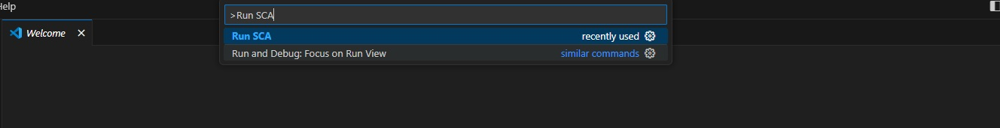
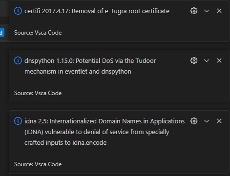

# vsca-code README

Here is a SCA plugin for VS Code. Its purpose is to assist developers during the development stage.

## Features

- [x] OSV API Integration
- [x] Parse "requirements.txt"
- [ ] Parse "pom.xml"
- [ ] Parse "Gemfile"
- [ ] Parse "grandle"
- [ ] Parse "package.json"

**Usage:**

**Output:**



## Requirements

```
npm install fs
npm install axios
```


**Enjoy!**
